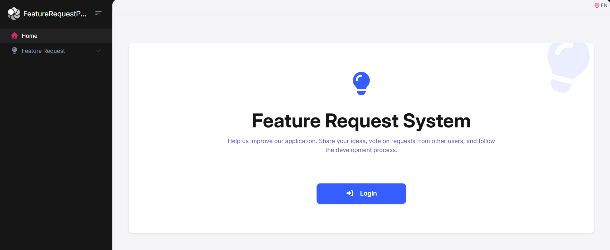
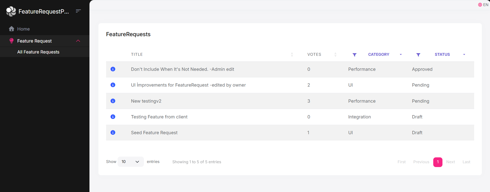
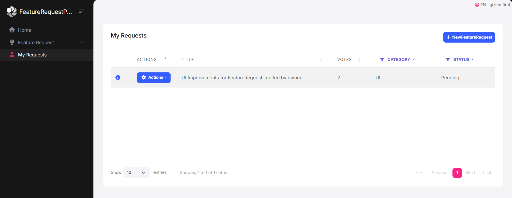
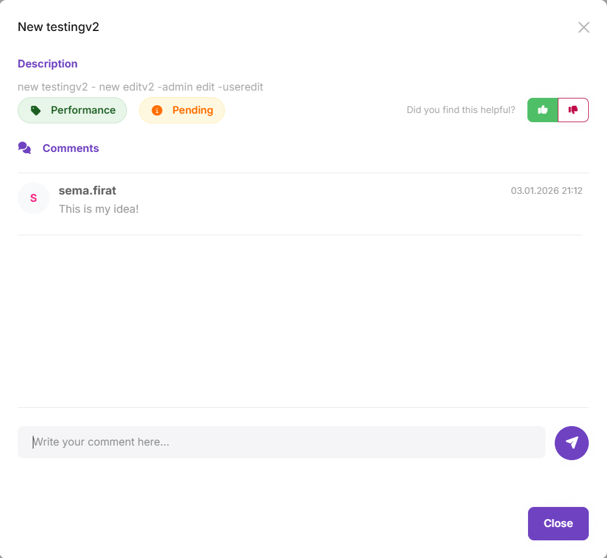

# FeatureRequestProject
# Feature Request Project (Talep Yönetim Sistemi)


## Proje Hakkında

**Feature Request Projesi**, bir saas ürününün kullanıcılarının yeni özellik taleplerinde bulunabileceği, mevcut talepleri oylayabileceği ve toplulukla etkileşime girebileceği modern bir web uygulamasıdır.

Bu proje, **Domain Driven Design (DDD)** prensipleri, **SOLID** kuralları ve **ABP Framework**'ün sunduğu modüler mimarisi kullanılarak alınarak geliştirilmiştir.

## Proje Özellikleri

* **Talep Yönetimi:** Kullanıcılar başlık, açıklama ve kategori belirterek yeni özellik isteği oluşturabilir.
* **Oylama Sistemi:** Kullanıcılar beğendikleri taleplere "Upvote" (Beğen)/"DownVote" (Beğenme) yapabilir veya oylarını geri çekebilir.
* **Yorum Sistemi:** Her talep altında kullanıcılar tartışabilir ve fikir beyan edebilir.
* **Gelişmiş Filtreleme:** Talepler kategoriye, duruma (Beklemede, Planlandı, Reddedildi vb.) veya oy sayısına göre filtrelenebilir.
* **Yetkilendirme (Permissions):** * Kullanıcılar sadece kendi taleplerini düzenleyebilir.
    * Adminler tüm içeriklere müdahale edebilir ve statü değiştirebilir.

## Projenin Genel Yapısı

### 1. Ana Sayfa ve Talepler Listesi
Anasayfada, sayfanın amaçlarına dair bilgiler edinilerek giriş yapmak için login sayfasına gidilebilir.



Yandaki menüden Talepler kısmına girildiğinde ise filtreleme seçeneği bulunan, bütün talepleri görebileceğiniz bir tablo bulunmaktadır. (Bu tabloyu görüntüleyebilmeniz için giriş yapmanıza gerek yoktur.)



### 2. Yeni Talep Oluşturma
Talepler listesinin üzerinde bulunan yeni talep oluşturma butonuna tıklayarak yeni talep oluşturma modal yapısına ulaşabilir ve yeni talebinizi oluşturabilirsiniz. (Bu işlem için giriş yapmanız gerekmektedir.)


### 3. Talepleri Görüntüleme
Bütün kullanıcılardan gelen talepleri görüntüleyebildiğiniz gibi kendi taleplerinizi de 'Taleplerim' menüsü üzerinden görüntüleyebilirsiniz. Burada, sadece kendi taleplerinizle sınırlı olmak üzere, taleplerini güncelleyebilir veya silebilirsiniz.



### 4. Talepleri Güncelleme
Taleplerin detayların görüntülenebilir, taleplere oy atılabilir ve taleplere yorum yapılabilir.



## Kullanılan Teknolojiler

### Backend
* **.NET 8.0**
* **Entity Framework Core** (Code First)
* **SQL Server**
* **ABP Framework** (Application, Domain, Infrastructure katmanları)

### Frontend
* **ASP.NET Core MVC / Razor Pages**
* **Bootstrap** & **jQuery**
* **ABP TagHelpers**
* **AJAX**

## Kurulum ve Çalıştırma

Projeyi yerel ortamınızda çalıştırmak için aşağıdaki adımları izleyin.

### Gereksinimler
* [.NET 8.0 SDK](https://dotnet.microsoft.com/download/dotnet/8.0)
* [SQL Server](https://www.microsoft.com/en-us/sql-server/sql-server-downloads
* [Node.js](https://nodejs.org/) (UI kütüphaneleri için)
* ABP CLI: `dotnet tool install -g Volo.Abp.Cli`

### Adım 1: Projeyi Klonlayın

```bash
git clone [https://github.com/gizemfirat/FeatureRequestProject.git](https://github.com/gizemfirat/FeatureRequestProject.git)
cd FeatureRequestProject
```

### Adım 2: Veritabanı Ayarları
`src/FeatureRequestProject.Web/appsettings.json` dosyasını açın ve `ConnectionStrings` bölümünü kendi veritabanı sunucunuza göre düzenleyin.

```json
"ConnectionStrings": {
    "Default": "Server=localhost;Database=YourDb;Trusted_Connection=True;TrustServerCertificate=True"
}
```

### Adım 3: Veritabanını Oluşturma (Migration Kullanılarak)
ABP'nin  migration aracı olan `DbMigrator` projesini başlangıç projesi olarak seçip çalıştırın. Bu işlem veritabanını oluşturacak ve başlangıç verilerini veritabanına ekleyecektir.

1. `src/FeatureRequestProject.DbMigrator` klasörüne sağ tıklayıp "Set as Startup Project" deyin (veya terminalden o klasöre gidin).
2. Projeyi çalıştırın. Konsol ekranı açılıp işlemler tamamlanınca kapanacaktır.

### Adım 4: Kütüphaneleri Yükleme
Web projesi dizininde (`src/FeatureRequestProject.Web`) terminal açın ve şu komutu çalıştırın:

```bash
abp install-libs
```

### Adım 5: Uygulamayı Başlatma
Proje artık hazır. Projeyi çalıştırabilirsiniz.

```bash
cd src/FeatureRequestProject.Web
dotnet run
```

> **Varsayılan Giriş Bilgileri:**
> * **Kullanıcı Adı:** admin
> * **Şifre:** 1q2w3E*